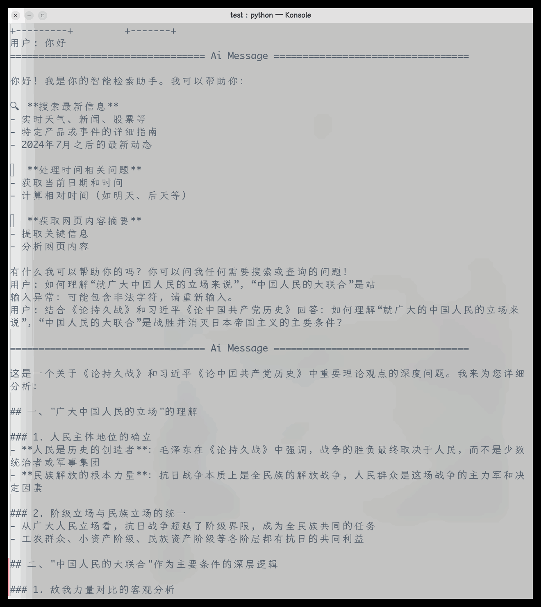
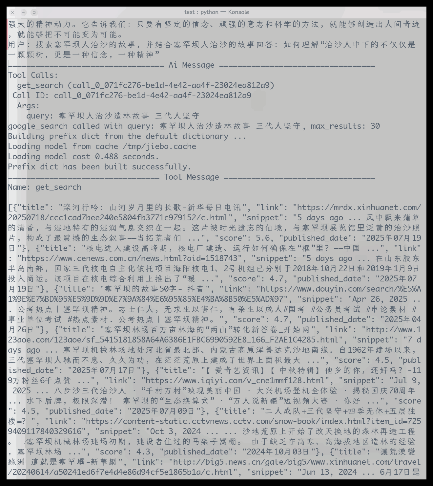

## 时间线
### 第一阶段
第一阶段目标：
- 快速实现一个基于大模型的智能对话功能（如智能问答、政策咨询等），让项目具备“AI智能体”雏形。
- 可用于演示、收集需求、后续集成更多党建业务功能。
#### 7-13
- 了解项目，确定选题和技术栈。
#### 7-14
- 使用ollama本地部署deepseek R1:7B大模型。
#### 7-15
- 调试后发现deepseek R1:7B回答效果并不理想，尝试改用Qwen2 7B。
- 使用transformers接入python, 实现基础对话功能。
- 调试模型的基础对话和多轮对话功能，基于langchain调试联网查询功能。
#### 7-16
- 本地模型回答幻觉过高，调试解决。
#### 7-17
- 基础对话中幻觉率明显下降，LLM类基础功能实现。
- 使用github进行版本管理，项目地址：https://github.com/ShaoChenHeng/collab-ai
- 拓展RAG，目前最方便的是先添加联网搜索。使用DDGS或者google进行联网搜索，搜索结果会有许多。如何选择最相关的几项作为参考并连接到prompt？
#### 7-18
- 通过langchain的ReAct机制控制llm自动搜索。问题是，langchain的ReAct轮数较低，有时候无法获取准确的回答。那么考虑后期手写ReAct，更加灵活地控制思考轮数。
- 用“权威性”、“相关性”、“新鲜度”三个指标优化搜索结果的排序。权威性：用一个可扩展的权威性网站表对url进行匹配打分，越官方的网站，分数越高。相关性：计算title或者snippet中出现的搜索关键词词频，频率越高相关性越高。新鲜度：计算网页发布日期，越新的网页分数越高。
#### 7-19
- 我的web-search-tool能够返回title、link、snippet，但是有时候snippet中提供的信息不全（网站正确），agent无法根据已有信息提供回复。实现了一个爬虫（url-summary），进入web-search-tool返回的link中爬取更加详细的信息作为补充。
- 调试基于langchain的ReAct机制。
- 本地大模型调用太占用显存，加载时间较长，暂时停用。使用deepseek-api替代。
#### 7-20
- 调试基于langchain的ReAct机制。目前的问题是，当工具列表变得复杂，工具之间存在依赖关系之后（在进行搜索之前需要获取日期，url-summary基于web-search-tool返回更完整的网页结果）agent有时候会使用工具，有时候又不会使用。
#### 7-21
- langchain的issue中有用户反应该问题，该问题较普遍，但是社区目前似乎没有计划修复。那么尝试手写ReAct。
- langgraph提供了一种更加灵活的方法构建agent，尝试使用langgraph。
- 为了实现多轮对话，我使用的是ConversationBufferMemory，而这个类即将被弃用，或许因为这个类导致了问题？
- [基于 LangGraph 创建智能体应用](https://www.aneasystone.com/archives/2024/10/create-agents-with-langgraph.html)介绍了基于LangGraph构建agent的方法，那么接下来我将基于这篇文章构建agent。
#### 7-22
- 使用langgraph重新构建了agent，测试后agent能够调用各项工具。在不同问题情境下能够符合正确逻辑地调用合适的工具。
#### 7-23
- 阅读LangGraph官方文档，调试样例。
- 目前agent基础功能已经完备，满足第一阶段要求“智能对话功能（如智能问答、政策咨询等）”，以2025年研究生考试政治试卷题目为例进行问答测试，回答结果如下：

**抗日战争问题**

**治沙人问题**

agent能够根据用户需求进行相关问题的搜索，并在搜索结果中选取最相关的几项网页，进入网页中归纳summary。最后结合summary进行回答。支持资料溯源，在回答的末尾提供资料来源网站。

- 以上测试均基于deepseek-api，我尝试了本地部署的Qwen2-7B模型，但是无法真正地使用工具，查看Qwen社区的issue有用户反应该问题，社区还未修复。
#### 7-24
- 开始使用fastAPI写后端
#### 7-26
- 阅读fastAPI文档，调试后端代码
#### 7-27
- 重构agent代码
- 完成聊天界面
#### 7-28
- 实现前后端连接，能够在vue的界面中实现和agent的对话
- 美化聊天界面，增加动态效果
当前界面如下：
[message-box](../docs/pics/message-box.png)

- 增加agent的流式输出功能
#### 7-29
- 添加agent中间过程显示
- gnome-shell莫名其妙内存泄漏，调试解决的时候把操作系统弄崩溃了，正在修复
#### 8-1
- 流式输出有问题，总是一次性将内容输出，修复了这个问题。并添加了淡入动画，更加丝滑。
- 修改发送按钮，在agent正在生成内容和未输入问题时，不可点击
- 实现强制网络搜索功能
#### 8-5
- 搜索工具会返回不安全的搜索结果，需要增加一种过滤的方法。用ahocorasick自动机+敏感词库实现过滤
